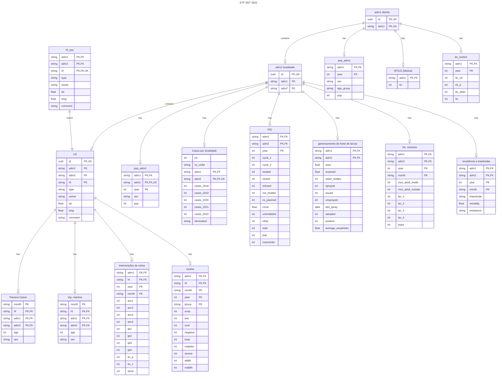
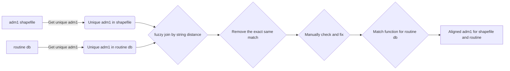

# STP SNT analysis 2023
The analysis coding for São Tomé and Príncipe subnational tailoring analysis 2023.

## Project Management

### Track Progress

Clickup was used to track the progress: [ClickUp STP Analysis Tracker](https://app.clickup.com/9010032161/v/li/900202049906).

GitHub Repository:

[STP Analysis GitHub Repository](https://github.com/sepmein/stp_snt_2023). 

[Code Issues and Improvements](https://github.com/sepmein/stp_snt_2023/issues).

## Replicate of this analysis

This analysis will use R `targets` package to ensure reproducibility.

### Packages to be installed

```r
install.packages(c("targets", "tarchetypes"))
```

## Data Management

Database relationships



### Match adm1, adm2 and hf

Approaches used:




#### adm1
In adm1_from_itn_route, there is an extra adm1 called "CNE", which might stands for National Center for Endemic Diseases (CNE) (Sao Tome and Principe). Not sure why, set CNE to NA firstly


#### hf

1. hf in routine database
mismatch after fuzzy matching

- POSTO DE QUARTEL
- P. SAÚDE DE V. D´AMÉRICA
- POSTO DE QUARTEL
- HOSPITAL DOUTOR QUARESMA DIAS DA GRAÇA
- POSTO DE NOVA APOSTÓLICA
- POSTO DE ÁGUA ARROZ
- POSTO SAÚDE DE PINHEIRA ROÇA
- P. S. DE RIBEIRA AFONSO should it be Ribeira Afonso I or Ribeira Afonso II(Sta Infancia)?
- P. S. IRMÃS C. DE R. AFONSO should it be Ribeira Afonso I or Ribeira Afonso II(Sta Infancia)?

### GIS
#### Shapefiles

##### Align shapefiles
> Problem


Green shapefile was provided by NMCP with detailed village level of information. Orange one was from WHO GISHUB. The unaligned borders between the two was noticed.

A aligned shapefile with adm1/adm2/adm3 level of information should be created before the analysis.

> Solution

I used the crs reprojection with the geo-referencing in QGIS to manually aligned the two islands.

##### Fix same localites names with same and different adm1

During the process, I found some of the localites has the exact same name, some of them located in the same district, others don't.

The shapefile country shared with us has duplicated records with the exact same adm1 and adm2. There are records with identical adm1 and adm2 values, some of which are adjacent to each other, while others are not. Attached is the list detailing these duplicates.

I have conducted a preliminary analysis and before proceeding further, I need confirmation from the country office on the following points:

- Merging Adjacent Duplicates:
Is it permissible to merge the records that are adjacent to each other, considering they share the same adm1 and adm2 values?

- Review of Non-Adjacent Duplicates:
For the records that are not adjacent but have identical adm1 and adm2 values, country need to review and confirm if these instances are due to naming errors or map inaccuracies? Additionally, it would be helpful to receive guidance on how to proceed with these records. 

##### the creation of the Health facility shapefile, the decision of Unit of analysis

> Problem
We have a shapefile with adm2 level. I need to create a hf level shapefile. There are two approaches:

1. The first approach
    - For each adm2, I calculated the closest HF. 
    - Assign a HF value to each adm2
    - For each HF group, union all the adm2s
    
The problem is that it is that for each HF group, there will be multiple adm1s. Country will be deciding the unit of analysis.
    
2. The second approach
    - Create adm1 shp based on adm2 shp
    - Within each adm1, for each adm2, calculate the closest HF
    - Assign a HF value to each adm2
    - For each HF group, union all the adm2s

##### HFs without any data

1. Uba Budo in Cantagalo.
2. Hospital Principe in Principe.

##### HFs with incorrect GPS

1. Porto Alegre POINT (6.63361 0.03556)
2. Santana POINT (6.74718 0.25813)

Resides outside of the adm1.
