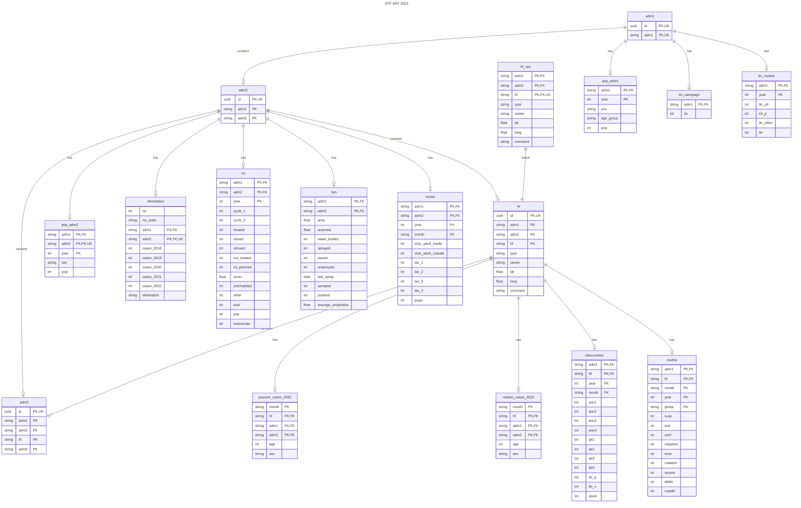

# STP SNT analysis 2023
The analysis coding for São Tomé and Príncipe subnational tailoring analysis 2023.

## Project Management

### Track Progress

Clickup was used to track the progress: [ClickUp STP Analysis Tracker](https://app.clickup.com/9010032161/v/li/900202049906).

GitHub Repository:

[STP Analysis GitHub Repository](https://github.com/sepmein/stp_snt_2023). 

[Code Issues and Improvements](https://github.com/sepmein/stp_snt_2023/issues).

## Replicate of this analysis

This analysis will use R `targets` package to ensure reproducibility.

### Packages to be installed

```r
install.packages(c("targets", "tarchetypes"))
```

## Data Management

Database relationships

