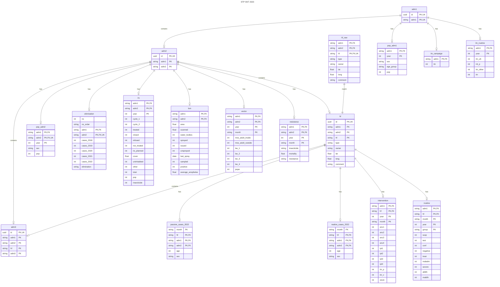
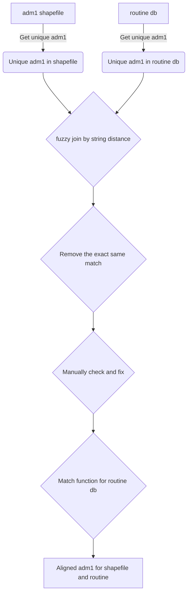
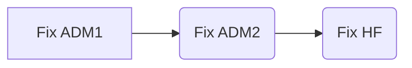

# STP SNT analysis 2023
The analysis coding for São Tomé and Príncipe subnational tailoring analysis 2023.

## Project Management

### Track Progress

Clickup was used to track the progress: [ClickUp STP Analysis Tracker](https://app.clickup.com/9010032161/v/li/900202049906).

GitHub Repository:

[STP Analysis GitHub Repository](https://github.com/sepmein/stp_snt_2023). 

[Code Issues and Improvements](https://github.com/sepmein/stp_snt_2023/issues).

## Replicate of this analysis

This analysis will use R `targets` package to ensure reproducibility.

### Packages to be installed

```r
install.packages(c("targets", "tarchetypes"))
```

## Data Management

Database relationships


### Match adm1, adm2 and hf

Approaches used:





#### adm1

#### hf

1. hf in routine database
mismatch after fuzzy matching

POSTO DE QUARTEL


### GIS
#### Shapefiles

1. aligned shapefiles
> Problem


Green shapefile was provided by NMCP with detailed village level of information. Orange one was from WHO GISHUB. The unaligned borders between the two was noticed.

A aligned shapefile with adm1/adm2/adm3 level of information should be created before the analysis.

> Solution

I used the crs reprojection with the geo-referencing in QGIS to manually aligned the two islands.

2. localites names same
During the process, I found some of the localites and adm2 name are the same, but with different area. I will use the adm2 shapefile and generate a list of localites with duplicated names. Those duplicates could be treated as two classes, the first one, same name with adjacent area, the second one, same name without any adjacent area.

3. check localites names with the 